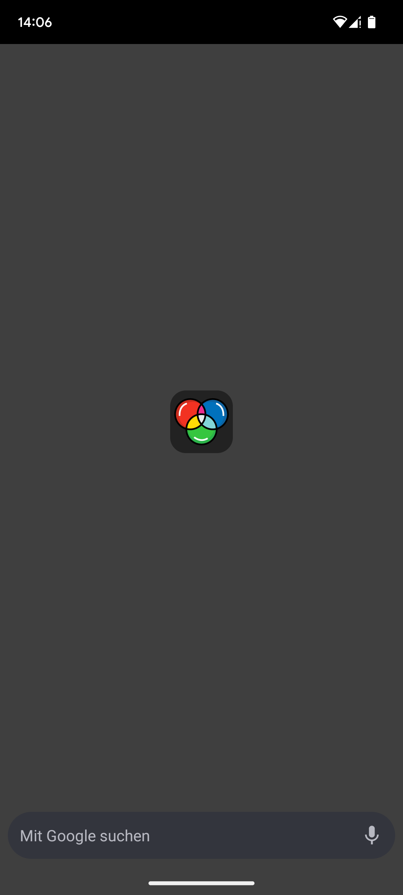
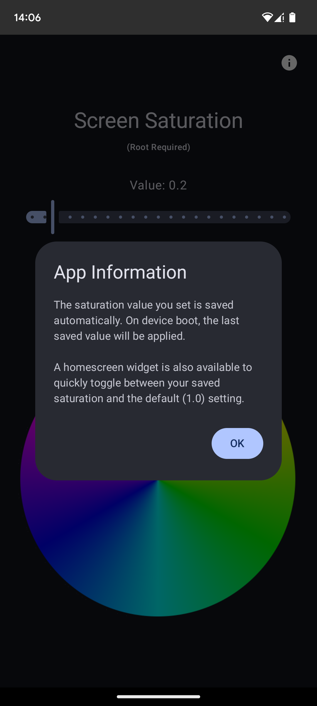

# Saturation Control App (Root Required)

**WARNING: This application requires ROOT access to function.** It modifies system display settings using non-standard methods. Use at your own risk.

## Description

This Android application allows users with rooted devices to adjust the screen saturation level. It provides finer control over display colors, enabling settings from grayscale (0.0) to highly saturated (up to 2.0), with 1.0 being the default/natural level.

The app directly interacts with the system's `SurfaceFlinger` service using internal commands (`service call SurfaceFlinger 1022 f X.X`).

## Features

* **Manual Saturation Control:** Adjust saturation using a simple slider in the main app interface (0.0 to 2.0).
    * _See: Main App UI screenshot below._
* **Setting Persistence:** The app remembers the last saturation value you successfully applied.
* **Apply on Boot:** Automatically applies your last saved saturation setting shortly after the device finishes booting.
* **Widget Toggle:** Includes a 1x1 homescreen widget to quickly toggle between your saved custom saturation value and the default value (1.0).
    * _See: Widget screenshot below._
* **Root Detection:** Checks for root access on launch and displays a warning pop-up if root is not detected or granted.
* **In-App Information:** An info button provides details about the app's features (persistence, boot setting, widget).
    * _See: Info Dialog screenshot below._
* **Workarounds:** Includes logic to handle potential system quirks when setting saturation back to the default value (1.0).

## Installation

1.  **Download:** Find the latest application package file (`.apk`) inside the `ready_to_download` folder in this repository.
2.  **Allow Unknown Sources:** On your Android device, you may need to enable "Install unknown apps" for your file manager or browser in system settings.
3.  **Install:** Open the downloaded `.apk` file and follow the prompts to install the application.
4.  **Grant Root Access:** Launch the app. When prompted by your root management application (e.g., Magisk), **grant root permissions permanently** to allow the app and its boot/widget features to function correctly.

## Screenshots

*(Please place your screenshots in a `readme_screenshots` sub-directory relative to this README file)*

**Main App Interface:**
 

 
*(Shows the slider, value display, apply button, and info icon)*

**Homescreen Widget:**
 

 
*(Shows the 1x1 widget used for toggling)*

**Information Dialog:**
 

 
*(Shows the pop-up displayed when the info button is pressed)*

## Important Notes

* **ROOT IS MANDATORY:** The app will not function without root access.
* **Undocumented API:** This app uses internal Android `service call` commands which are not officially documented or supported by Google. Compatibility and functionality are not guaranteed on all devices or future Android versions. The specific code (`1022`) might change or behave differently.
* **System Stability:** While generally safe, manipulating system services directly carries a small inherent risk.